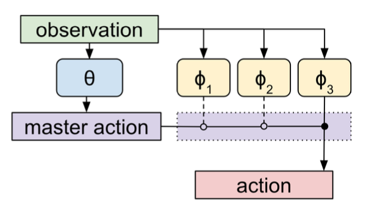

# Meta-Learning-Shared-Hiearies

В [статье](https://arxiv.org/pdf/1710.09767.pdf) рассматривается подход к обучению иерархический политики.
Основная цель данного метода - быстрое дообучение политики под новую задачу (модель не видела их в процессе обучения).

## Идея

Модель имеет иерархическую структуру и состоит из *мастер политики* обучаемой отдельно для каждой задачи,
и набора *подполитик*, общих для всего набора задач.

Мастер политика рассматривается как политика над подполитиками, т.е. отвечает за переключение между подполитиками
в процессе работы алгоритма.  
Подполитики, в свою очередь, отвечают за обучение некоторых примитивов работы, т.е. каждая полполитика отвечает за
специфичный сценарий.

## Формализация

Задача рассматривается как марковси процесс $ P(s',r | s, a) $, где 
$s', s$ - следующее и текущее состояние, $a$ действие, $r$ - ревард на данном шаге.  

Есть распределение над задачами (над марковскики процессами) $P_{M}$.
Агент описывается двумя наборами параметров: $\theta, \phi$, тогда политика агента $\pi_{\theta, \phi}(a|s)$.

Здесь
* $\theta$ - набор параметров мастер-политики, обучаемый заново для каждой задачи;
* $\phi$ - параметры подполитик, общие для всех для всех задач и обучаемые на наборе задач.

Задача в *meta-learning* задаче - оптимизировать награду на протяжении жизни агента.
Т.е в процессе обучения агента на выбранной задаче. 

## Архитектура

В работе предлагается иерархическая структура политики.
Общие параметры $\phi = \(\phi_1, \dots, \phi_k\)}$, где каждый вектор параметров $\phi_k$ соответствует отдельной
подполитике $\pi_{\phi_k}(a|s)$.  
Вектор параметров $\theta$ задает мастер-политику $\pi_{\theta}(a|s)$, задающую распределение над подполитиками.  
В предлагаемом метода переключение между подполитиками происходит каждые $N$ шагов $\(0, N, 2N, \dots\)$.

## Алгоритм обучения

Предлагается итеративно учить множество подполитик, при этом уча на каждом итерации мастер-политику. 
Обучение на каждой $m ~ P_M$ происходит в два этапа:

### Warmup

Предварительное обучение мастер политики. На этом этапе учатся только параметры $\theta$.  
Сыгранные шаги рассматриваются сгруппированными по $N$. То есть, действие - выбор подполитики, награда - суммарная
награда за $N$ шагов. 

### Joint

Совместное обучение мастер политики и подполитик. Делается $T$ шагов агента, затем оптимизируем $\theta$ группируя шаги
по $N$. Затем оптимизируем $\phi$ обычным способом.

Оптимизация проводилась с помощью A2C.

## Эксперимент: WIP

В ходе эксперимента проверялось:
* возможность метода к обучению. для этого сравнивался график среднего ревардра на проэмлированной задаче для 
    обученного MLSH и для необученного MLSH (т.е. для каждой задачи тренируем заново.) 
* преимущество иерархического подхода перед одной shared политикой. Для этого сравнивался средний ревард для MLSH c 
     среднем ревардом для одной политики, обучаемой тем же способом, т.е. по задачам.

Тестирование проводиться в средах Minigrid: DoorKey5x5, Empty, FourRoom. 

На текущем этапе эксперимент подтверждает только первый пункт. При этом колебания награды при обучении очень велики.
Возможно, это обусловлено выбранным методом обучения (A2C). Хотя, в случае обучения обычной политики в обычном режиме 
(не на одна эпоха - одна задача), алгоритм сходиться.